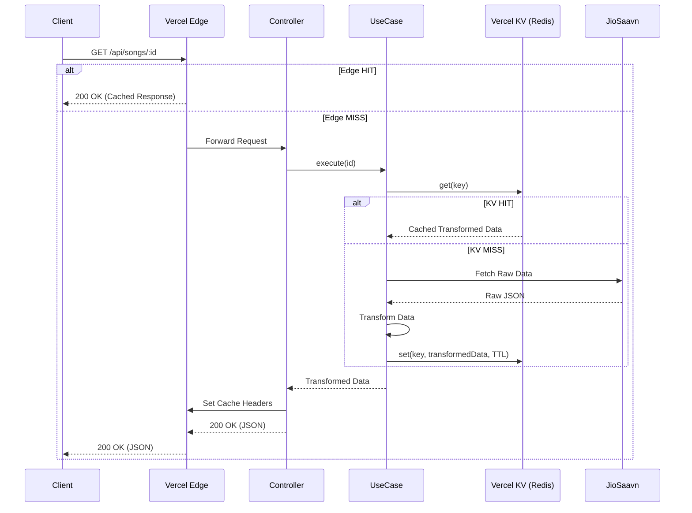

# JioSaavn API Architecture

Welcome to the **JioSaavn API** project! This document provides a deep dive into the architecture, design patterns, and internal workings of the API. It is designed to help you understand how data flows through the system and the reasoning behind our technical decisions.

For instructions on setting up your development environment, please see the [Developer Guide](DEVELOPER_GUIDE.md).

---

## 🚀 Overview

JioSaavn API is an unofficial wrapper for [JioSaavn](https://jiosaavn.com), written in **TypeScript** and powered by **Bun** and **Hono**. It provides a clean, RESTful interface to search for and retrieve songs, albums, artists, and playlists, including high-quality download links.

### Key Features
- **Modular Design**: Easy to extend and maintain.
- **Type Safety**: Built with TypeScript and Zod for robust data validation.
- **Fast Performance**: Powered by Bun and Hono's lightweight framework.
- **OpenAPI Support**: Automatically generated Swagger/Scalar documentation.

---

## 🛠 Tech Stack

- **Runtime**: [Bun](https://bun.sh/) (Fast all-in-one JavaScript runtime)
- **Framework**: [Hono](https://hono.dev/) (Ultrafast web framework for the Edges)
- **Validation**: [Zod](https://zod.dev/) (TypeScript-first schema validation)
- **API Documentation**: [Scalar](https://scalar.com/) with OpenAPI 3.1
- **Testing**: [Vitest](https://vitest.dev/)
- **Encryption**: [node-forge](https://github.com/digitalbazaar/forge) (Used for decrypting media URLs)

---

## 🏗 Architecture & Design Patterns

The project follows a **Modular Monolith** structure inspired by Clean Architecture principles. Each domain (songs, albums, artists, etc.) is isolated into its own module.

### Core Patterns
1. **Controller-Service-UseCase Pattern**:
   - **Controllers**: Handle HTTP requests, define routes, and validate input using Zod schemas.
   - **Services**: Orchestrate the business logic by calling one or more Use Cases.
   - **Use Cases**: Represent a single, specific action (e.g., "Get Song By ID"). This keeps the code DRY and easy to test.
2. **Repository-less Data Fetching**: Instead of a traditional database, our "data source" is the internal JioSaavn API. We use a centralized `useFetch` helper to interact with it.
3. **Data Transformation**: Raw data from JioSaavn is transformed into clean, consistent models before being returned to the client.

---

## 📁 Project Structure

```text
src/
├── common/             # Shared utilities, constants, and types
│   ├── constants/      # API endpoints and user agents
│   ├── helpers/        # Fetching logic, link decryption
│   ├── models/         # Global Zod schemas
│   └── types/          # Global TypeScript types
├── modules/            # Domain-specific modules
│   ├── songs/          # Example module
│   │   ├── controllers/# Route definitions and request handling
│   │   ├── services/   # Orchestration layer
│   │   ├── use-cases/  # Individual business logic units
│   │   ├── models/     # Song-specific Zod schemas
│   │   └── helpers/    # Data transformation logic
│   └── ...             # albums, artists, search, playlists
├── pages/              # Static HTML pages (e.g., Home page)
├── app.ts              # App initialization and middleware
└── server.ts           # Entry point for the server
```

---

## 🔄 Request Lifecycle & Multi-layer Caching

When a client sends a request, it follows a multi-layer caching strategy to ensure low latency and reduced pressure on upstream servers.

### Caching Layers
1.  **Edge Cache (Vercel)**: Responses are cached at the edge using `Cache-Control` headers (`s-maxage`). This is the fastest layer.
2.  **Distributed Cache (Vercel KV)**: If edge cache misses, the application checks Vercel KV (Redis) for a cached version of the transformed data.
3.  **Upstream API**: If both caches miss, the application fetches fresh data from JioSaavn, transforms it, and populates the caches.



---

## 🔍 Deep Dive: How it Works

### 1. Interacting with JioSaavn
JioSaavn uses an internal PHP-based API. We mimic a real browser or mobile app by sending requests to `https://www.jiosaavn.com/api.php` with specific query parameters:
- `__call`: The internal function name (e.g., `song.getDetails`).
- `api_version`: Usually `4`.
- `_format`: Always `json`.
- `ctx`: Context (e.g., `web6dot0`).

### 2. Media Link Decryption
JioSaavn encrypts high-quality media URLs using **DES-ECB**.
- **The Secret**: We use a hardcoded key (`38346591`) to decrypt the `encrypted_media_url`.
- **The Process**: Once decrypted, we get a base URL. We then replace quality identifiers (like `_96`) with others (`_12, _48, _160, _320`) to provide multiple quality options to the user.
- **Implementation**: See `src/common/helpers/link.helper.ts`.

### 3. Data Transformation (Payloads)
Raw responses from JioSaavn are often messy and contain inconsistent naming conventions.
- We use **Zod Models** (`src/modules/*/models`) to define what the API response *should* look like.
- **Helpers** (`src/modules/*/helpers`) take the raw data and map it to our clean models.

---

## 👨‍💻 Intern's Guide: Adding a New Feature

Suppose you want to add a new endpoint to fetch "Artist Top Songs".

### Step 1: Define the Use Case
Create `src/modules/artists/use-cases/get-artist-top-songs/get-artist-top-songs.use-case.ts`.
Implement the `IUseCase` interface. Use `useFetch` to get data and a helper to transform it.

### Step 2: Update the Service
Add a method to `ArtistService` that instantiates and calls your new Use Case.

### Step 3: Create the Controller/Route
In `ArtistController`, define a new route (e.g., `/artists/:id/top-songs`).
Use `this.router.openapi()` to define the route with Zod validation so it automatically shows up in the documentation.

### Step 4: Add Tests
Create a `.spec.ts` file next to your use case or controller. Run `bun test` to ensure everything works.

---

## 📈 Future Improvements

- **Rate Limiting**: Protect the API from abuse.
- **SDK**: Create a client-side SDK for easier integration in web/mobile apps.
- **Error Handling**: Implement more granular error messages and logging.

---

For more details on coding standards and how to contribute, refer to the [Developer Guide](DEVELOPER_GUIDE.md).
